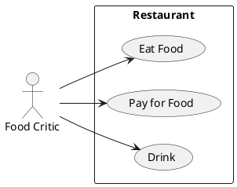

# Описание требований и архитектуры

## Введение
<!-- Общее краткое описание создаваемой системы -->
В рамках курса осуществляется проектирование решения на основе [постановки задачи от "заказчика"](./task.md).

- [Описание требований и архитектуры](#описание-требований-и-архитектуры)
  - [Введение](#введение)
  - [Заинтересованные стороны](#заинтересованные-стороны)
  - [Бизнес-контекст (бизнес-требования)](#бизнес-контекст-бизнес-требования)
  - [Глоссарий](#глоссарий)
  - [Модель предметной области](#модель-предметной-области)
  - [Требования к системе](#требования-к-системе)
    - [Сценарии использования (Use case)](#сценарии-использования-use-case)
    - [Функциональные требования](#функциональные-требования)
    - [Нефункциональные требования/Требования к атрибутам качества](#нефункциональные-требованиятребования-к-атрибутам-качества)
    - [Ограничения](#ограничения)
  - [Архитектура](#архитектура)
    - [Журнал архитектурных решений](#журнал-архитектурных-решений)
    - [Контекст решения](#контекст-решения)
    - [Компонентная архитектура](#компонентная-архитектура)
    - [Реализация сценариев использования](#реализация-сценариев-использования)
    - [Программные интерфейсы](#программные-интерфейсы)
    - [Схема развертывания](#схема-развертывания)
  
## Заинтересованные стороны
<!-- Перечень заинтересованных сторон и их интересов по отношению к создаваемой системе. 
Подробнее: https://confluence.mts.ru/pages/viewpage.action?pageId=399975538 
-->
| Заинтересованная сторона | Участники             | Интересы                                                                     | Точки зрения                                                                      |
|:-------------------------|:----------------------|:-----------------------------------------------------------------------------|:----------------------------------------------------------------------------------|
| Организатор              | Иванов Иван           | Удобство использования, Стоимость, Время создания решения                    | Диаграмма контекста                                                               |
| Слушатель                | Сидоров Сидор         | Удобство использования                                                       | Руководство участника                                                             |
| Докладчик                | Петров Петр           | Удобство использования, Производительность                                   | Руководство докладчика                                                            |
| Рецензент                | Алексеев Алексей      | Удобство использования                                                       | Руководство рецензента                                                            |
| Администратор            | Максимов Максим       | Удобство использования, Конфигурабельность                                   | Руководство администратора                                                        |
| Инженер эксплуатации     | Никифоров Никифор     | Удобство использования, Производительность, Конфигурабельность, Безопасность | Руководство технического администратора, Диаграмма развертывания                  |
| Архитектор               | Александров Александр | Архитектура решения, Ограничения, Требования                                 | Диаграмма контекста, Диаграмма компонентов, Диаграмма контейнеров, Диаграммы кода |

## Бизнес-контекст (бизнес-требования)
<!-- Общее описание бизнес-контекста создаваемой системы (автоматизируемой деятельности), список бизнес-целей заинтересованных сторон 
Подробнее: https://confluence.mts.ru/pages/viewpage.action?pageId=399973845
-->
### Предпосылки (текущее состояние)
Заказчику необходим инструмент для проведения технической конференции на регулярной основе. Форматы - онлайн и оффлайн.

### Цели и задачи
В рамках данного решения будет создана система, которая включает в себя следующие возможности:
* Работа с докладчиками - сбор и рецензирование докладов, обратная связь докладчикам
* Работа с расписаниями - составление и администрирование расписаний
* Проведение конференции - онлайн - инструмент для проведения онлайн трансляции и сбор обратной связи с пользователей
* Проведение конференции - оффлайн - инструменты для бронирования площадок и времени, интеграция с расписанием, регистрация участников

### Бизнес-цели и результаты
Провести серию из 10+ конференций не менее, чем с 5 докладами в каждой и не менее, чем с 100 слушателями (онлайн + оффлайн).

### Сроки реализации
Создание системы необходимо завершить до планируемой даты первой конференции - 31 августа 2023 года.

### Область применения и границы
#### Область применения
* Целевая аудитория: специалисты сектора информационных технологий.
* География: Москва и область (оффлайн конференция), Российская Федерация (онлайн конференция)

#### Ограничения и допущения
* Онлайн трансляции подразумевают участие не более, чем 1000 человек
* Доклады для рецензирования принимаются в едином формате
* Доклады, принятые к рассмотрению, храняться без ограничения срока

## Глоссарий
<!-- Содержит основные понятия и термины предметной области  
Подробнее: https://confluence.mts.ru/pages/viewpage.action?pageId=375782595
-->
| Понятие  | Сокращение | Определение                                                                                               |
|:---------|:-----------|:----------------------------------------------------------------------------------------------------------|
| Доклад   | Report     | Общее описание свойств конкретного доклада, присланного на конференцию (включая артифакты самого доклада) |
| Артифакт | Artifact   | Документ или видео, подготовленное в ходе обработки доклада                                               |
 | Отзыв    | Review     | Документ, предоставляемый потенциальному докладчику в качестве обратной связи                             |

## [Модель предметной области](data/data.md)

## Требования к системе

### Сценарии использования (Use case)
<!-- Подробное описание сценариев использования системы с привязкой к ролям участников и задействованным бизнес-сущностям 
https://confluence.mts.ru/pages/viewpage.action?pageId=375782108 
https://confluence.mts.ru/pages/viewpage.action?pageId=375782119 
-->
#### Диаграмма сценариев использования (Use Case Diagram) <!-- omit in toc -->

#### Список сценариев использования <!-- omit in toc -->

| ID     | Описание                                          |
|--------|---------------------------------------------------|
| UC.001 | *[Название сценария использования](uc/uc.001.md)* |

### Функциональные требования
<!-- Описание требований к функциям, реализуемым системой. Требование может быть привязано к сценарию использования или быть общим 
Подробнее: https://confluence.mts.ru/pages/viewpage.action?pageId=375782501 
-->
| ID     | Название требования                | Описание требование                                                                                                                                                                                                  |
|--------|------------------------------------|----------------------------------------------------------------------------------------------------------------------------------------------------------------------------------------------------------------------|
| FR.001 | Прием докладов                     | Система должна предоставлять возможность приема докладов в едином формате с минимальной валидацией (технической) этого формата                                                                                       |
| FR.002 | Рецензирование докладов            | Система должна предоставлять возможность просмотра и составления рецензий на доклад, с отправкой рецензии докладчику                                                                                                 |
| FR.003 | Составление программы конференции  | Система должна предоставлять возможность выбора одобренных рецензентами докладов, и включения их в программу конференции                                                                                             |
| FR.004 | Составление расписаний конференции | Система должна предоставлять возможность автоматического составления расписания конференции, с последующими ручными правками. При составлении расписания должны быть учтены параметры конфигурации (перерывы и т.д.) |
| FR.005 | Тестовый прогон докладов           | Система должна предоставлять возможность в режиме онлайн собирать мини-конференции для тестового прогона докладов на ограниченную аудиторию (рецензенты).                                                            |
| FR.006 | Онлайн трансляция конференции      | Система должна предоставлять возможность транслировать конференцию в режиме онлайн для зарегистрированных слушателей.                                                                                                |
| FR.007 | Управление площадкой               | Система должна предоставлять возможность вносить информацию о площадке проведения и её администрирование (заказ пропусков, регистрация участников)                                                            |

### Нефункциональные требования/Требования к атрибутам качества
<!-- Требования к основным архитектурным характеристикам (атрибутам качества) системы - надежность, масштабируемость, ИБ, и др.
Подробнее: https://confluence.mts.ru/pages/viewpage.action?pageId=375782530
-->
| ID     | Атрибут качества             | Описание требования                       |
|--------|------------------------------|-------------------------------------------|
| QR.001 | *Название атрибута качества* | *Описание требования к атрибуту качества* |

### Ограничения
<!-- Описываются ограничения, оказывающие влияние на архитектуру системы - временные, финансовые, технологические
Подробнее: https://confluence.mts.ru/pages/viewpage.action?pageId=375782592
-->
| ID     | Ограничение            |
|--------|------------------------|
| AC.001 | *Описание ограничения* |

## Архитектура

### Журнал архитектурных решений
<!-- Записи о ключевых принятых архитектурных решениях (ADR) для реализации архитектурно-значимых требований.
Подробнее: https://confluence.mts.ru/pages/viewpage.action?pageId=421162308
-->
- [ADR.NNN Суть решения](adr/adr-template.md)

### [Контекст решения](context/context.md)

### [Компонентная архитектура](components/components.md)

### Реализация сценариев использования
<!-- Реализация сценариев использования на основе взаимодействия компонентов системы и внешних систем/участников.
Диаграммы последовательности (UML Sequence diagram) и текстовое описание.

Подробнее: 
https://confluence.mts.ru/pages/viewpage.action?pageId=399442132
https://confluence.mts.ru/pages/viewpage.action?pageId=399442170
-->
| ID     | Описание                          | Реализация                                    |
|--------|-----------------------------------|-----------------------------------------------|
| UC.001 | *Название сценария использования* | [Реализация сценария](uc-impl/uc.001-impl.md) |

### Программные интерфейсы
<!-- Спецификации публичных API системы и ее компонентов (синхронных, событийных). Создается на основе модели предметной области для реализации сценариев использования. 
  Форматы: OAS/Swagger, GraphQL, AsyncAPI/CloudEvents
-->
| Компонент             | Интерфейс                                      |
|:----------------------|:-----------------------------------------------|
| *Название компонента* | *[Название интерфейса](api/service-name.yaml)* |

### [Схема развертывания](deployment/deployment.md)
